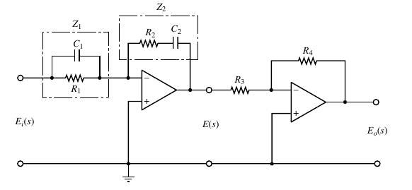
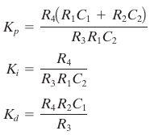

# Conceituação

*  Interconexão de componentes físicos que tem como
  finalidade controlar (regular/dirigir/ comandar) um
  determinado processo para fornecer uma resposta
  desejada.
*  **HIstory**
  *  The first automatic feedback controller used in an industrial process is gener-
    ally agreed to be James Watt’s flyball governor, developed in 1769 for controlling
    the speed of a steam engine 
*  **?**
  *  ISA: international society of automation
*  **Sobre projetos em controle**
   *  o que sai mais caro: acionadores e drivers, ampops bons, profissional-hora

## Terminologia

*  Processo: Qualquer operação a ser controlada (Ex.: A fusão nuclear)
*  Planta: Qualquer dispositivo ou complexo físico a ser controlado (ex: reator)
* Perturbações: sinal de entrada que tende a afetar desfavoravelmente o valor da saída do sistema.

  * Interna: gerada dentro do sistema (realimentação positiva);
  * Externa: gerada fora do sistema (entrada adicional).
*  Referência: valor desejado da variável a ser controlada.
*  Comparador: elemento que gera o sinal de erro como a diferença entre a
   referência e o valor atual.
*  Controlador: elemento que manipula o sinal de erro e gera o sinal de
   controle de forma a corrigir o valor da variável controlada.
*  Atuador: dispositivo de potência que recebe o sinal de controle e produz a
   entrada para o processo/planta.
*  Transdutor: elemento responsável pela medição e conversão da variável
   controlada em uma grandeza adequada à comparação com a referência.
*  Usualmente representamos a função de saída por $C(s)$

## Tipos de controle

* **Malha aberta**

  * A ação de controle é independente da saída; na inexistencia de perturbações, costumam ser muito estáveis

  

* **Sistema de Controle em Malha Fechada (MF)**
  
  * A variável de saída do processo a controlar tem efeito direto na ação
      de controle.
  * :keyboard: matlab: `<a>/.<b>` performs FTMF de a realimentado com b
  
  

* **Controle adaptativo**: detecta variações na panta

  

## Representações
* EDO

### Diagrama de blocos

* See in Signal and Systems
*  To draw a block diagram for a sys-
  tem, first write the equations that describe the dynamic behavior of each component.
  Then take the Laplace transforms of these equations, assuming zero initial conditions,
  and represent each Laplace-transformed equation individually in block form. Finally, as-
  semble the elements into a complete block diagram.
* :book: Block Diagram transformations: Dorf pg 81

### Diagrama de fluxo de sinal

* Complementar ao Diagrama de Blocos

* permite representar condições iniciais, o que o diagrama de bloco não permitia

* (+) simples e rápido de desenhar

* **elementos**

  * nodes = variables
  * edges = transfer functions (transmitances)
  * Percurso diréto: leva da entrada pra saída
  * laço: caminho fechado
  * laço disjunto: não se tocam 
  * do nó de entrada só saem edges, no nó de saída só chegam

* cascata série: produto das transmitâncias

* cascata paralela: soma das transmitâncias

* A Fomula de Mason pode ser usada para identificar a função de transferência:

  

* O determinante do sistema é dado por:

  

* Os cofatores $\Delta_k$ são obtidos de $\Delta$ removendo os laços que tocam os percursos $T_k$ .

### Espaço de estados

* (+) Bom para sistemas não lineares

* (+) Bom para sistema multiple-input-multiple-output

* (-) O tratamento matemático é todo vetorial, e raramente visualizável graficamente

* state: smallest set of variables such that knowledge of these variables at t=t0 , together with knowledge of
  the input for t $\geq$ t0 , completely determines the behavior of the system for any time
  t $\geq$ t0 .

* state variables: variables that are part of the State

* state vector: putting togueder the state variables

* state space: space whose axis are the state variables

* **Metodologia de projetos**

  * Qual é a forma padrão do equacionamento?

  * É comum escolhermos como variáveis de estados a grandeza física relacionada à elementos armazenados de energia:

    

## Índices de desempenho

* Ou *métricas de mérito*

* o quanto o motor faz o que é preciso

* Para um certo sistema e uma certa entrada, as métricas podem geralmente ser calculadas de forma analítica

* **métricas básicas**
  * <u>valor de regime permanente</u>

    * para uma certa entrada, geralmente degrau
    * Para resposta ao degrau ou impulso: $y(\infty) = \lim_{s\rightarrow 0}sY(s)$ (não esqueça de considerar o sinal de entrada)
    
  * <u>tempo de subida</u>

    * tr=t90% - t10%

    * ou simplesmente t90%

    * Para segunda ordem, para $0.3<\zeta<0.8$:
      $$
      tr=\frac{2.16 \zeta + 0.6}{w_n}
      $$
      

  * <u>instance de pico (tp)</u>

    * Para segunda ordem:
      $$
      t_p = \frac{\pi}{w_n \sqrt{1-\zeta^2}}
      $$
      

  * <u>sobresinal máximo (Mp)</u>

    * percentual, $[0,1]$

    * Para segunda ordem:
      $$
      M_p = e^{-\frac{\pi \zeta}{\sqrt{1-\zeta^2}}}
      $$
      

  * <u>setling time (ts)</u>

    *  (até estabiizar em um percentual do valor permanente, geralmente uns 5%); para sistemas de segunda ordem, geralmente podemos aproximar usando apenas a envoltória exponencial (4 tau)
    * Para segunda ordem, aproximando:

    $$
    t_{s5\%}= 3 \tau = \frac{3}{\zeta w_n}
    $$

* **Erros**

  * <u>Erro de Regime Permanente ($e_{ss}$) genérico</u>

    * valor de regime permanente - valor setado
    * Pode ser calculado diretamente pelo valor final do sinal de erro, inclusive usando teorema do valor final
    * O erro pode ser calculado diretamente por:
    * 
    * Para segunda ordem, resposta à rampa: $e(\infty) = \frac{2\zeta}{w_n}$
    
  * <u>Coeficiente de erro de posição estático (KP)</u>
    
    * relacionado à entrada degrau
    
    * Definido como:
    
      
      $$
      e_{ss}=\frac{1}{1+K_P}
      $$
      
    
  * <u>Coeficiente de erro de velocidade estático (KV)</u>
    
    * Relacionado à entrada rampa
    
    * Definido como:
    
      
      $$
      e_{ss}=\frac{1}{K_V}
      $$
    
  * <u>Coeficiente de erro de aceleração estático (KA)</u>

    * Relaciona à entrada parabólica

    * Definido como:

      
      $$
      e_{ss}=\frac{1}{K_A}
      $$

* **Bandwidth**
  * ?
  * The bandwidth may often
    be an important factor when noise is present at the input and generated within the
    system

## Considerações sobre sistemas

* Muitas coisas aqui estão em Sinais e Sistemas, mas nem tudo eu consegui juntar

* Para sistemas de ordem maior que 2, nós podemos
  frequentemente usar as técnicas de pólos dominantes para
  aproximar o sistema por uma função de transferência de 2a
  ordem (dois pólos).

* Forma canônica de um sistema de segunda ordem:

  
  
  > Zeta é adimencional; é tipo que multiplica na frequencia

* A transformada inversa de Laplace da resposta ao degrau desse sistema é bem conhecida, dada por:

  


* perceba que aquele arctg é apenas um angulo fixo de defasagem
* O termo $w_n\sqrt{1-\zeta^2}$ é usualmente chamado de frequência natural amortecida, $w_d$, e pode ser obtida diretamente diretamente do gráfico no caso subamortecido
* zeta maior -> oscila mais, mas sobre mais devagar?
* For a given $w_n$, the response is faster for lower $\zeta$, but the overshoot will be bigger (and probably the settling time too)
* se tem um polo na origem, erro permanente será zero?
* zeros só afetam o transitório?
* **Principais equações**
  * <u>Análise em malha fechada</u>
    * Bom para analizar quase tudo
    * $FTMF(s)=\frac{G(s)}{1+G(s)*H(s)}$
    * Equação característica: polinomio do numerador da FTMF
  * <u>Análise em malha aberta</u>
    * $FTMA=G(s)*H(s)$
    * para analisar estabilidade
  * <u>análise em malha direta</u>
    * Quando um sistema é análisdo sem a realimentação (malha aberta), também é chamado *malha direta*; improtantte pra analisar o transitório
    * $FTMD(s)=G(s)$
* **Tres casos de raízes**

  * se estiverem no semiplano direto, instável
  * <u>reais distintas</u>
    * ksi>1
    * superamortecido
    * Se ksi>>1, podemos aproximar por um sistema de primeira ordem (ver slide 3 número 25)
  * <u>Reais iguais</u>
    * ksi=1 
  * <u>complexas conjugadas</u>
    * if 0<ksi<1
    * if ksi=0, oscilates forever
    * Distancia entre as raízes = sigma = o quanto oscila
* **Orders above 2**

  * many sys-
    tems possess a dominant pair of roots and the step response can be estimated by second ordem system
  * <u>Inserção de polo</u>
    * diminuindo a estabilidade relativa;
    * deixando o tempo de acomodação mais lento.
    * Dado um sistema e terceira ordem na forma:
  * 
    * podemos aproximar por um sistema de segunda se $\frac{1}{T} \geq 10 |\zeta w_n|$ (equivalente ao terceiro polo ser 10x maior que os outros dois?)
  * <u>inserção de zero</u>
    * aumenta estabilidade relativa;
    * Tempo de acomodação menor (acelera a resposta)
    * Sobresinal maior
* **Systems with zeros**

  *  If the
    transfer function of a system possesses a finite zero and it is located relatively
    near the dominant complex poles, then the zero will materially affect the transient
    response of the system

## Estabilidade

* vai pro regime permanente fixo

* instáveis costumam ter um tempo de subida menor

* raízes instável são dominantes: uma raíz instável caga o polinomio inteiro

* estabilidade absoluta: é ou não é

* estabilidade relativa: fornece um grau de estabilidade, uma margem

* Adicionar um integrador (polo na origem) deixa o sistema mais instável

* Relative stability can also br measured by the settling time of each root or pair of roots. Therefore, a system
  with a shorter settling time is considered relatively more stable.

* **Estabilidade da resposta forçada**
  
  * Ou *BIBO*
  * é o critério mais usado, na prática
  * Condição (necessary and sufficient): estável se todos os pólos da FTMF estiverem
    localizados no semi-plano esquerdo do plano “s”, eixos não inclusos
  * pensando na ILT, vemos que um um polo com parte real positiva levará à uma exponencial com t positivo
  * Caso contrário, y(t) conterá uma componente de
    crescimento ilimitado quando t cresce.
  * <u>marginalmente estável</u>
    * only certain bounded inputs (sinusoids of the frequency of the poles) will cause the output to
      become unbounded
    * when poles are exactly in the jw exis
    * não decai a zero nem vai para o infinito
    * um sistema marginalmente estável não é estável
  
* **Estabilidade da resposta livre**

  * Ou *assintótica*
  * Muito similar à BIBO, ressaltarei aqui apenas as diferenças
  * Se, para qualquer condição inicial, a resposta vai a zero
  * Condição (necessary and sufficient): estável se todos os *modos* estiverem localizados no semi-plano esquerdo do plano “s”, incluso eixo
  * relembrando: modos =  raízes da FTMF antes de cancelarmos com os zeros (ou seja, a equação característica original)?

* **critério/método de routh-hurwitz**

  * Conta o número de raizes da FTMF no semiplano direito, sem calcularlas 

  * analisa estabilidade absoluta

  * (+) pode ser feito com termos genérico (tipo um K livre)

  * Condições necessárias: Todos os coeficientes do polinômio tenham o mesmo sinal? Nenhum dos coeficientes seja nulo?

  * <u>:keyboard: scilab: routh_t(<polinomo>)</u>

    * com variável livre só funciona se for na realentação

    * Exemplo, com FTMF=k/s^3…

      ```
    k=poly(0, ‘k’)
      EC = s^3 …
      routh_t(1/EC, k)
      ```
  
      

  * <u>prodecimento</u>

    * ache o polinomio numerador do FTMF:

      
  
    * Reorganize os termos da seguinte forma (sempre duas linhas):
  
    
  
    
  
    * multiplique em sizezage descendo, dividindo pelo inferior esquerdo
  
    * dica: pense em um determinante tomado 2x2 em 2x2 (originalmente o método era todo por determinante)
  
    * na forma:

      

    * O ultimo termo será sempre igual ao termo independente
  
    * Case 1: No element in the first column is zero; proceed normally
  
    * Case 2 there is a zero in the first column, but some other elements of the row containing the zero; proceed normally (knowing that there is a pole exactly in the axis)
      in the first column are nonzero
  
    * Case 3: there is a zero in the first column, and the other elements of the row containing the zero are also zero; proceed using the coeficients of the derivate of the auxiliary equation (see in slide 23)
  
    * Case 4: as in the third case, but with repeated roots on the $j\omega$ axis.
  
  * <u>Análise do resultado</u>
  
    * Olharemos apenas para a primeira coluna, com os termos na sequência
    * o numero de trocas de sinal indica o numero de polos no semiplano direito 
    * Quando um termo é zero, geralmente a estabilidade é limítrofe (par de raízes no eixo imaginário)
    * Se houver uma variavel livre, podemos obter as faixasde valor tal que o sistema seja estável
  
  * Caso especial: linha toda zero
  
    * ?
  
* **Análise por state space**

  * location of the eigenvalues of the system matrix
  
* **Condição de pertinenca**

  * a partir da equação de malha aberta
  * condição suficiente mas não necessária
  * Para ser estável um sistema deve ter $|GH|<1$ na frequência em que $fase(GH)=180$ (ou multiplos, 180 + k*360)
  * quanto mais distante desse limiar, mais estável 

* **Critério de Nyquist**

  * graphical technique for determining the stability of a dynamical system
  * can be applied to systems defined by non-rational functions
  * restricted to linear time-invariant (LTI) systems

* **Critério de barkhausen**

  * Critério para condição de oscilação em estruturas realimentadas
  * a complex pole pair must be placed on the imaginary axis of the complex frequency plane
  * Veja em *osciladores*

* **Lyapunov criterion:** for non linear

* **Circle criterion:** for non linear

## Outros

* **Tipo do sistema**
  
  * numero de polos na origem na FTMA
  
  * ou seja, numero de elementos integradores na malha aberta
  
    
    
  * Para cada tipo de sistema (ver em outros) e cada entrada, podemoschegar em expresões analíticas para os erros, conforme tabela do slide 3-29 do Joni
  
* **Experimental determination of the transfer function**

  * chose step or impulse response
  * apply the input and measure the output
  * collect the operation data
  * curve fitting; usually we use a sum of exponential, $\sum k_i e^{\tau_i t}$
  * if you want to use different ad hoc input functions, collect the data, fit a curve on the input, and take the lapace transform?

# Técnicas de análise

## Root Locus

* plotar como as raízes se movimentam no plano S ao variármos um parâmetro k

* K multiplica tudo… existem variações?

* 

* Developed by Evans in 1948

* provides a measure of the sensitivity of the roots of the
  system to a variation in the parameter being considered
  
* A partir da FTMA
  
* **Root locus plot**
  
  * :keyboard: ​scilab: evans(<FTMA>, <maxK>)
  
  * :keyboard: matlab: rlocus(<sys>)
  
  * :keyboard: scilab com melhorias do Joni:
  
    ```matlab
    s=%s;
    num= 1;
    den= s*(s+4)*(s^2+2*s+2);
    m= length(coeff(num))-1; n= length(coeff(den))-1;
    FTMA=syslin('c',num,den);
    clf(); evans(FTMA,500);
    xgrid(31); // adiciona uma grade de cor 31
    l=gca(); // retorna o identificador dos eixos
    l.isoview= 'on';
    l.data_bounds=[-4.5 1 -3 3]; // altera os limites dos dados
    l.x_location = 'origin'; // eixo x na origem
    l.y_location = 'origin'; // eixo y na origem
    l.y_label.position = [0,3.7]; // altera a posição do rotulo do eixo y
    l.y_label.text= 'jw'; // altera o rotulo do eixo y
    disp(l.children); // imprime o vector que contém os identificadores de todos os objetos filhos dos eixos
    legenda= l.children(1);
    legenda.visible= 'off'; // legenda invisível
    ramos= l.children(2); // espessura e cor de cada ramo
    n_ramos= n;
    cor= 2;
    thick= 3;
    for r=1:n_ramos
      ramos.children(r).thickness= thick;
      ramos.children(r).foreground= cor;
      cor= cor+1;
    end
    
    n_assintotas= n-m;
    if (n_assintotas>0) then
      for a=1:n_assintotas
      	disp ("heyyy")
        l.children(2+a).line_style=2; // assintotas tracejadas
      end
    
      if length(l.children)>=(n_assintotas+4) then
        l.children(n_assintotas+4).thickness=3; // espessura dos polos
        l.children(n_assintotas+4).mark_size=10;      
      end
      if length(l.children)>=(n_assintotas+5) then
        l.children(n_assintotas+5).thickness=3; // espessura dos zeros
        l.children(n_assintotas+5).mark_size=10;
        l.children(n_assintotas+5).mark_style=9;
      end
    elseif
      l.children(n_assintotas+3).thickness= 3; // espessura dos polos
      l.children(n_assintotas+3).mark_size= 10;
      l.children(n_assintotas+4).thickness= 3; // espessura dos zeros
      l.children(n_assintotas+4).mark_size= 10;
      l.children(n_assintotas+5).mark_style= 9;
    
    end
    
    [Ki,s1]=kpure(FTMA); // K para imaginario puro
    plot([real(s1) real(s1)],[imag(s1) -imag(s1)],'sr');
    disp(Ki,'k(inst)= ');
    disp(s1,'s(inst)= ');
    
    ```
    
    
    
  * m e n: os mais altos graus do numerador e denominador da FTMA, respectivamente
  
  * traçamos os polos para k de zero a infinito
  
  * Os polos se aproximam dos zeros (ou de initifito, se houver mais polos que zeros) quando k tende a infinito
  
  * Se em um ponto do eixo real há um número ímpar de polos e zeros à sua direita, esse ponto percente ao L.R.
  
  *  
  
  * Os polos que são vão para zero seguem assíntoras
  
  * As assíntotas são centradas em um ponto do eixo real dado por:
  
    
  
  * e com ângulos dados por:
  
    
  
  * ponto de ruptura: quando pois polos se unem e deixam o (ou chegam no) eixo real
  
  * O ponto de ruptura ocorrerá onde K alcança o seu ponto de máximo
    sobre o eixo real. Assim basta, diferenciar a equação de K(s) em
    relação a s, igualar a zero, pegar a máxima raiz real
  
* * 

## Bode plot

* Ver mais em *Análise de circuitos* e *Sinais e Sistemas*

* bastante usado para projeto de compensadores

* A partir da FTMA

* **Análise de margens**
  * Margens de fase e de ganho
  
  * determinar as margens de estabilidade (relativa)
  
  * Quão distantte está das condições de pertinência (ver em *estabilidade*)
  
  * cuidado: no bode plot, magnitude 1 = 0 dB
  
  * Margem de fase: no ponto crítico de magnitude, quanta fase falta para 180º
  
  * margemde ganho: no ponto crítico de fase, quanto ganho falta para zero
  
  * Margens positivas = sistema estável
  
  * <u>dicas práticas</u>
  
    * margem de fase deve estar entre 30° e 60°;
  
    * margem de ganho deve ser maior que 6dB.
  
    * :keyboard: Scilab plots:
  
      ```matlab
      s=%s;
      num= 24;
      den= s*(s+2)*(s+4);
      FTMA= syslin('c', num, den);
      
      [mf ,fg]=p_margin(FTMA)
      [mg,ff]=g_margin(FTMA)
      printf('Margem de fase: %.2f graus\n', mf)
      printf('Frequência onde o ganho é 1: %.2f Hz\n', fg)
      printf('Margem de ganho: %.2f dB\n', mg)
      printf('Frequência onde a fase é 180º: %.2f Hz\n', ff)
      show_margins(FTMA);
      ```
  
  * A margem de fase ($\gamma$) pode ser determinada analiticamente para um sistema de 2º ordem:
  $$
    \gamma=\arctan\left(\frac{2\zeta}{\sqrt{\sqrt {4\zeta^4+1} - 2\zeta^2}}\right)
  $$
  
    
  
  
  
  > WG = frequencia (rads/s) onde o ganho é 1
  
* **Análise da inclinação**

  * variações rápidas no bode plot da FTMA são indicativos de instabilidade
  * essa análise é especialmente relevante na frequência de cruzamento da margem de ganho
  * Uma inclinação do módulo em -20dB/década é bem estável
  * Inclinação for de -40dB/década é ruim
  * Inclinação -60dB/década, o sistema provavelmente é instável.

## Nyquist plot

* (+) Permite analisar atrasos (tempo morto) na inicialização

* gráfico polar em função de $\omega$

* objetivo: identificar se há polos no semiplano direito

* **Fatores**

  * mesmos do bode

* **Sobre formas arbitrárias no plano polar**

  * baixas frequências?:

    

  * altas f:

    

* **analise**

  * Efeitos de ressonancia acontecem quando a amplitude é máxima. Se a máxima amplitude acontece em angulo 0 (DC?), não haverá nenhuma ressonanscia
  * polos forçam traçados horários
  * zeros forçam traçados antihorários
  * sistemas realizáveis no mundo possuem sempre uma tendência a traçados horários
  * de forma geral, quando a frequência aumenta o angulo aumenta e o módulo diminui
  * de forma geral, é siétrico em relação ao eixo polar (“x”)
  * Podemos traçar vários gráficos, para vários k, para analisar a estabilidade

* **numero de circulação de um dado ponto**

  * quantas vezes a curva descreve 360º ao redor do gráfico

* **plano domínio e plano imagem**

  * Valores de $s$ (domínio) e para onde eles levam na equação (imagem)
  *  
  * circulação de nada: circulação não envolvendo zero
  * circulação de um zero: circulação da origem no mesmo sentido
  * circulação de polos: circulação da orgem no sentido inverso
  * circulação de polos e zeros se anulam

* **Diagrama de nyquist**

  * Usamos a FTMA (ou 1+ FTMA?)

  * o raciocínio de circulação da origem no plano domínio é, no diagrama de nyquist, em relação ao ponto $(-1,0)$ (pois usamos a FTMA e não o denominador da FTMF)

  * Quando a circulação passa por cima de um polo ou zero, não inclui este

  * a curva de circulação de nyquist é dada por:

    

  * Análse feita todo no plano imagem

  * por causa do $+1$, estamos interessados em analisar se a circulação no plano imagem passe por $-1+j0$ ao invés da origem
    $$
    Z = N + P
    $$

    > N = quantas vezes o plot circula $(-1,j0)$ no sentido horário, podendo ser negativo
    > P = número pólos de $1+G(s)H(s)$ no SPD

  * A estabilidade é definida por Z

  * Se Z<=0, a FTMF do sistema é ESTÁVEL;

  * Se Z>0, a FTMF do sistema é INSTÁVEL;

  * Traçado manual: ponto a ponto?

  * :keyboard: scilab:

  ```matlab
  s=%s;
  num=1;
  den=(s+1)*(s-2);
  FTMA=syslin('c', num, den);
  nyquist(FTMA, 1E-6, 1E+6);
  l=gca();
  //l.isoview= 'on';
  l.x_label.text= 'Re[GH(jw)]';
  l.y_label.text= 'Im[GH(jw)]';
  plot(-1,0, 'x')
  //zoom_rect([-2,-1,0,1])
  //title('Nyquist plot for k=1')
  ```

* **Analisando margem de fase a de ganho**

  * Podem ser obtidos diretamente do nyquist plot

  * Gain margin = $20\log\left(\frac{1}{\text{where plot cross x}}\right)$

  * Phase margin = angulo de cross com circulo unitário = $arctg\left(\frac{\text{y do cross}}{\text{x do cross}}\right)$

    
    
    ```matlab
    s=%s;
    num= 24;
    den= s*(s+2)*(s+4);
    FTMA= syslin('c', num, den);
    clf();
    nyquist(FTMA, 1E-6, 1E+6);
    show_margins(FTMA, ‘nyquist’);
    [mf ,fg]=p_margin(FTMA) ; disp(fg,mf);
    [mg,ff]=g_margin(FTMA) ; disp(ff,mg);

    ```

## Nichols charts

* Loop gain vs loop phase? 
* 

# Técnicas de controle clássico

* the design of a control system is concerned with the plan of the system structure and the selection of suitable components and parameters.
  
* **Pretende melhorar**
  
  * robustez
  * estabilidade
  * resposta transitória
  * resposta de regime permanente
  
* **on–off controllers**
  
  * Or *Two-position*
  
  * the signal u(t) remains at either a maximum or minimum value
  
  * we can also add histeresis, or *diferencial gap*,  to prevent too-frequent operation of the on–off mechanism
  
    

## Compensador

* botar um polo e um zero a mais

* é mais “cirurgico” que o PID

* Mainly using root locus

* Zeros e polos reais

* The compensator placed in the feedforward path is called a cascade compensator, but we can have it in the feedback, output (or load), or input

* We’ll focus on cascade compensators

  

  

* Ampop implementation: dorf pg 756 (dá pra fazer um lead-lag colocando capacitores em paralelo com R3 e R4)
  
* **Compensador em Avanço de Fase (Lead)**
  
  * polo maior (em módulo) do que o zero
  
  * É um filtro passa alta
  
  * (+) incrementa a estabilidade relativa
    
  * (+) fica mais rápido (rise time decrease)
    
  * (+) aumento da margem de fase
  
  * (+)  increases the system bandwidth
  
  *  (-) há um incremento do erro de regime (principalmente s K for pequeno)
  
  *  (-) Fica mais suceptível à ruidos de alta frequência
  
  *  Dado por:
  
     
  
  * Cuidado com o ganho Kc, pode afetar o erro em regime permanente
  
  * <u>Metodologia de design - Por LR</u>
  
    * escolhe-se KC, normalmente pela especificações de erro de regime permanente.
  
    * Escolhe-se um ponto $s1$ do plano “s”, que pertença ao lugar das raízes:
      $$
      s_1=-\zeta\omega_n + j\omega_n\sqrt{1-\zeta^2}
      $$
  
    * Calcula-se $G(s_1)$
  
    * Para que o sistema compensado passe por esse ponto, temos que:
  
      
  
      
  
    * :keyboard: scilab:
  
      ```matlab
      // Desired parameters
      Kp=9;
      Kv=%inf;
      Ka=%inf;
      omega= 100;
      zeta= sqrt(2)/2;
      
      // Current system
      s= %s;
      numG= 1;
      denG= (0.1*s + 1)*(0.2*s + 1);
      
      // Calculate parameter
      clc();
      pi= %pi;
      G= syslin('c',numG,denG);
      H= 1;
      FTMF= G/.H;
      if Kp~=%inf then
      	Kc= horner((Kp/(G*H)), 0);
      elseif Kv~=%inf then
      	Kc= horner((Kv/(s*G*H)), 0);
      else
      	Kc = horner((Ka/(s*s*G*H)), 0);
      end
      disp(Kc, 'Kc= ');
      
      s1= -(zeta*omega)+((omega*(1-zeta^2)^0.5)*%i);
      [mS,tetaS]= polar(s1);
      tetaS= real(tetaS);
      Gs1= horner((G*H), s1);
      [mG,tetaG]=polar(Gs1);
      tetaG= real(tetaG);
      disp((180*tetaS/pi), 'tetaS= ',mS, 'mS= ');
      disp((180*tetaG/pi), 'tetaG= ',mG, 'mG= ');
      Tz= real((sin(tetaS)-(Kc*mG*sin(tetaG-tetaS)))/(Kc*mG*mS*sin(tetaG)));
      Tp= real(-((Kc*mG*sin(tetaS))+(sin(tetaG+tetaS)))/(mS*sin(tetaG)));
      disp(Tp,'Tp [s]= ',Tz,'Tz [s]= ');
      
      // Plot system
      numC= Kc*(Tz*s+1);
      denC= (Tp*s+1);
      Gc= syslin('c',numC,denC);
      FTMFc= (Gc*G)/.H;
      figure(1);
      clf(1);
      t= 0:0.002:2;
      step=csim('step',t,FTMF);
      step2=csim('step',t,FTMFc);
      plot(t,step,'b-',t,step2,'m-');
      xgrid(33);
      figure(2);
      clf(2);
      evans(G*H,100);
      xgrid(33);
      figure(3);
      clf(3);
      evans(Gc*G*H,100);
      xgrid(33);
      
      ```
  
  * <u>Metodologia de deisng - Por Bode</u>
  
    * ?
  
    * :keyboard: scialb:
    
      ```matlab
      clc();
      s= %s;
      pi= %pi;
      Kv= 10;
      mF2= 52;
      numG= 400;
      denG= s*(s^2+30*s+200);
      G= syslin('c',numG,denG);
      H= 1;
      FTMA= G*H;
      FTMF= G/.H;
      Kc= horner((Kv/(s*FTMA)), 0); // Kv=s*[Kc.GH(0)]
      KcGH= Kc*G*H;
      figure(1);
      clf(1);
      show_margins(KcGH,'bode');
      [mF,fG]= p_margin(KcGH);
      Fi= mF2-mF;
      Fi1= Fi+5; // adiciona 5 graus
      alfa= (1+sin(Fi1*pi/180))/(1-sin(Fi1*pi/180));
      Ganho_ad=-10*log10(alfa);
      disp(Ganho_ad,'Ganho_ad [dB]=');
      wGhz= 1.571; // tirado (em Hz) do Diag. de Bode de KcGH
      wG= wGhz*(2*pi);
      T= 1/((alfa^0.5)*wG);
      alfaT= alfa*T;
      disp(alfaT,'alfaT [s]= ',T,'T [s]= ');
      
      numC1= Kc*(alfaT*s+1);
      denC1= (T*s+1);
      Gc1= syslin('c',numC1,denC1);
      FTMFc1= (Gc1*G)/.H;
      Fi2= Fi+10; // adiciona 10 graus
      alfa= (1+sin(Fi2*pi/180))/(1-sin(Fi2*pi/180));
      Ganho_ad=-10*log10(alfa);
      disp(Ganho_ad,'Ganho_ad [dB]=');
      wGhz= 1.133; // tirado (em Hz) do Diag. de Bode de KcGH
      wG= wGhz*(2*pi);
      T= 1/((alfa^0.5)*wG);
      alfaT= alfa*T;
      disp(alfaT,'alfaT [s]= ',T,'T [s]= ');
      numC2= Kc*(alfaT*s+1);
      denC2= (T*s+1);
      Gc2= syslin('c',numC2,denC2);
      FTMFc2= (Gc2*G)/.H;
      clf
      //figure(0);
      //clf(0);
      t= 0:0.002:10;
      step0=csim('step',t,FTMF);
      step1=csim('step',t,FTMFc1);
      step2=csim('step',t,FTMFc2);
      plot(t,step0,'b-',t,step1,‘m-',t,step2,'g-');
    xgrid(35);
      xtitle('Step Response','Time (sec)','Amplitude');
      % Possível melhoria: No pega qual será o efeito da defasagem no GANHO e ajustar conforme
      ```
    
  * <u>Metodologia de design - wtf</u>
  
    * List the system specifications and translate them into a desired root location for the
      dominant roots.
    2. whether Sketch the the root desired locus root with locations a constant can gain be realized.
     controller, Gc1s2 = K, and determine
    3. If a compensator is necessary, place the zero of the phase-lead compensator directly
    below the desired root location (or to the left of the first two real poles).
    4. Determine the pole location so that the total angle at the desired root location is 180°
    and therefore is on the compensated root locus.
    5. Evaluate the total system gain at the desired root location and then calculate the error
    constant.
  
* **Compensador em Atraso de Fase (Lag)**
  
  * Zero maior
  * É um filtro passa baixa
  * (+) reduz o erro de regime permanente
  * (+) reduz o ruido de alta frequência
  * (-) sistema fica mais lento (rise time icreases)
  * (-) decreases the system bandwidth
  * a diferença de design é pouca (comparando com compesador em avanço), a difereça existe só nos requisitos
  * <u>Design - por LR</u>
    * igual???	
  * <u>Design - por bode</u>
    * escolhe-se KC, normalmente pela especificações de erro de regime permanente.
    * Se for dado zeta, ache a margem de fase $M_\phi$
    * por segurança, acrescentamos alguns graus
    *  
    * determinar alpha (o quanto Tz está acima de Tp)
    * Tz deve ser entre 0 e 1 (senão você fez um compensador em avanço, rsrs)
  
* **Compensador em Avanço-Atraso de Fase (Lead-Lag)**
  
  * bota os dois juntos
  * Melhora a resposta tranitória
  * aumenta a estabilidade relativa
  * equivalente à u um passa faixa ou um passa alta
  * <u>Design</u>
    * Os dois devem ser projetados juntos
    * primeiro projeta o em avanço (sem projtar o K), depois o em avanço


## PID

* fine tuning of PID controllers can be made on-site

* when the mathematical model of the plant is not known and there-
  fore analytical design methods cannot be used, PID controls prove to be most useful.

* (+) dá pra praticamente comprar pronto
  
* (-) não funciona muito bem para sistemas com muito tempo morto (daí a solução é controle digital?)
  
* zeros e polos complexos conjugados
  
* **Proportional controllers**
  
  * ?
  
* **Proportional+integral controllers**
  
  * é o controlador mais comum
  * mesmo em controladores PID, muitas vezes o D é desligado
  * (+) garante erro steady state nulo
  * (+) tempo de subida mais baixo
  * (-) Less stable
  * (-) mais overshoot
  * processos de primeira ordem funcionam bem com PI
  
* **Proportional+derivative controllers**
  
  * (-) deixa o sistema mais lento
  * (-) qualquer ruido deixa o sistema doido
  * é usual botarmos um filtro passa faixa na entrada para diminuir essa sensibilidade
  
* **Proportional+integral+derivative controllers**
  
  * o integrador zero o erro; pode ser usado sozinho, mas é instável
  
  * o derivador deixa mais estável; não pode ser usado sozinho
  
  * Definida pela equação (pode estar no tempo ou não frequencia; em função de Tau ou dos polos/zeros):
  
    
  
    
  
    
  
  * pode ser implementado por um circuito eletrônico, do tipo:
  
    
    
    

## Fine-tuning

* costuma precisar de bastante ajuste (*sintonia*); as vezes os fabricantes impoem algumas limitações nos ajustes que podem ser feitos
* most PID controllers are adjusted on-site
* some of the PID controllers may possess on-line automatic tuning
  capabilities.

* **Ziegler–Nichols Rules**
* for tuning
  * experimental approach
  * when a mathematical model cannot be easily obtained
* **computational optimization approach** 
  * ?

## Preditor de smith

* Lida bem com tempo morto

# Controle moderno

* Geralmente trabalha mais no domínio do tempo, ao invés da frequenia
* Geralmente MIMO (multi input mult output)?
* geralmente estocástico (descrito por características estatísticas), ao invés de determinístico
* **Controle digital**
  * (-) geralmente mais lento do que analógico


