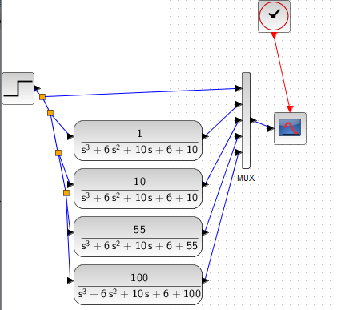
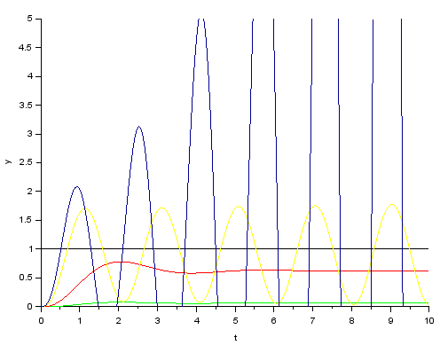
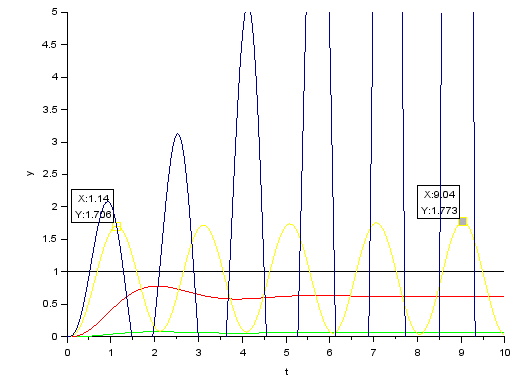

variando um parâmetro k, avaliar a estabilidade do sistema com FTMF dada por:

$$
FTMF(s) = \frac{k}{s^3 + 6s^2 + 10s + 6 + k}
$$

pelo critério de RR, para um sistema estável devemos ter -6<k<54?

Simulação com o xcos:

resultados:

